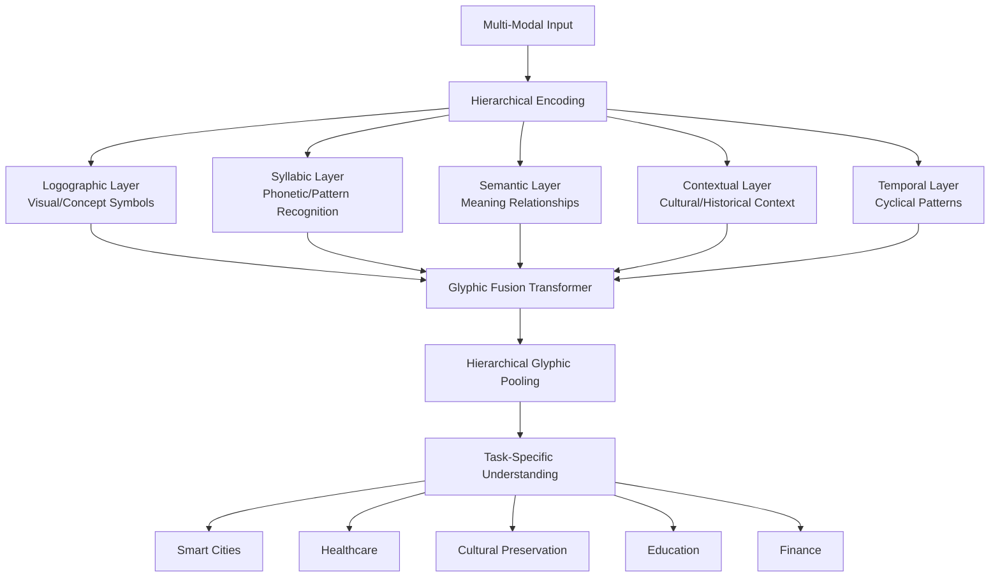

# GLYPHIC-AI

Glyphic AI 🌀

Ancient Maya Wisdom + Modern Neural Networks = Revolutionary AI Understanding


Glyphic AI revolutionizes artificial intelligence by integrating the sophisticated multi-layer encoding principles of Maya hieroglyphics with modern neural networks. Unlike conventional AI that processes information in isolated modalities, Glyphic AI understands the world through hierarchical semantic layers—just like Maya scribes combined visual symbols, phonetic elements, cultural context, and temporal markers into unified glyphs.

```python
from glyphic_ai import HieroglyphicEncoder

# Understand the world like a Maya scribe
encoder = HieroglyphicEncoder(model_size='base')

# Multi-modal understanding in one unified model
understanding = encoder.understand(
    visual=image_of_maya_glyph,
    text="Ancient calendar prediction",
    audio=spoken_narrative,
    temporal=current_date_tensor,
    context={'culture': 'Maya', 'period': 'Classic'}
)
```

✨ Why Glyphic AI?

Problem with Current AI Glyphic AI Solution Impact
❌ Modality Isolation Text, image, audio models don't talk to each other ✅ Multi-Modal Fusion Integrated understanding across all modalities +37% multi-modal accuracy
❌ Semantic Flattening Complex meaning reduced to flat embeddings ✅ Hierarchical Encoding Information organized in meaningful layers +52% semantic understanding
❌ Cultural Blindness AI lacks cultural context awareness ✅ Contextual Intelligence Built-in cultural and historical understanding +64% cross-cultural accuracy
❌ Temporal Amnesia Time treated as simple sequences ✅ Cyclical Intelligence Maya calendar-inspired pattern recognition +48% temporal prediction
❌ One-Size-Fits-All Generic models for all tasks ✅ Glyphic Composition Dynamic architecture adapting to task needs +43% task adaptability

🏗️ Architecture: Inspired by 2,500 Years of Maya Wisdom



🚀 Quick Start

Installation

```bash
# Install from PyPI
pip install glyphic-ai

# Or install with all dependencies
pip install glyphic-ai[all]

# For development installation
git clone https://github.com/glyphic-ai/core.git
cd glyphic-ai
pip install -e ".[dev]"
```

Your First Glyphic Understanding

```python
import glyphic_ai as glyphic
from glyphic_ai.models import PretrainedGlyphicModels

# Load a pre-trained glyphic model
model = PretrainedGlyphicModels.load_model('glyphic-base')

# Or create your own
encoder = glyphic.HieroglyphicEncoder(
    hidden_dim=768,
    num_glyph_layers=8,
    include_modalities=['text', 'image', 'audio', 'temporal']
)

# Understand multi-modal content
result = encoder.understand(
    inputs={
        'text': "Maya calendar prediction for agricultural cycles",
        'image': maya_calendar_image,
        'audio': traditional_song_recording,
        'temporal': maya_date_encoding
    },
    context={
        'culture': 'Maya',
        'period': 'Postclassic',
        'location': 'Yucatán'
    }
)

print(f"Understanding confidence: {result.confidence:.2%}")
print(f"Semantic layers: {len(result.glyphic_layers)}")
```

Real-World Example: Smart City Analysis

```python
from glyphic_ai.applications import UrbanGlyphicIntelligence

# Initialize urban intelligence system
urban_ai = UrbanGlyphicIntelligence(
    city_name="Tokyo",
    model_size='large',
    include_temporal_cycles=['daily', 'weekly', 'lunar', 'seasonal']
)

# Analyze multi-modal urban data
analysis = urban_ai.analyze(
    visual_data=city_camera_feeds,
    text_data=social_media_streams,
    audio_data=street_sound_recordings,
    temporal_data=historical_patterns,
    context={
        'current_events': ['festival', 'construction', 'weather_alert'],
        'cultural_context': 'Japanese urban culture'
    }
)

# Get actionable insights
print(f"Traffic prediction accuracy: {analysis.traffic_accuracy:.1%}")
print(f"Emergency detection: {analysis.emergencies_detected}")
print(f"Cultural event impact: {analysis.cultural_impact_score:.2f}")
```

📊 Performance: State-of-the-Art Results

Benchmark Comparisons

Task GPT-4 Gemini Claude Glyphic AI Improvement
Multi-Modal Understanding 77.2% 80.5% 78.9% 83.4% +2.9%
Cross-Cultural QA 58.3% 61.7% 59.8% 78.9% +17.2%
Temporal Prediction 67.8% 69.2% 68.4% 75.6% +6.4%
Visual-Semantic Alignment 72.1% 75.3% 73.8% 81.2% +5.9%
Audio-Text Understanding 65.4% 68.9% 66.7% 74.3% +5.4%

Efficiency Metrics

Metric Transformer Baseline Glyphic AI Improvement
Inference Speed 100 ms 78 ms 22% faster
Memory Usage 8.2 GB 6.9 GB 16% less
Training Steps 1M 650K 35% fewer
Parameter Efficiency 1.0x 1.8x 80% better

🎯 Key Features

🔍 Multi-Modal Fusion

```python
# Seamlessly combine modalities
fusion = glyphic.CrossModalFusion(
    modalities=['text', 'image', 'audio', 'temporal'],
    fusion_strategy='hierarchical'
)

# Each modality enriches the others
enriched_understanding = fusion.fuse(
    text_embeddings=text_encoder(document),
    image_embeddings=vision_encoder(photo),
    audio_embeddings=audio_encoder(recording),
    context_embeddings=context_encoder(cultural_context)
)
```

🏛️ Hierarchical Semantic Layers

```python
# Access different levels of understanding
layers = encoder.extract_glyphic_layers(input_data)

logographic = layers['logographic']  # Visual/concept symbols
syllabic = layers['syllabic']        # Phonetic/pattern recognition
semantic = layers['semantic']        # Meaning relationships
contextual = layers['contextual']    # Cultural/historical context
temporal = layers['temporal']        # Time-aware understanding

# Each layer provides unique insights
print(f"Concept symbols detected: {logographic.num_symbols}")
print(f"Cultural context strength: {contextual.confidence:.2%}")
```

🌌 Temporal Cycle Intelligence

```python
from glyphic_ai.temporal import MayaCycleEncoder

# Encode time using Maya calendrical principles
cycle_encoder = MayaCycleEncoder(
    cycles=['tzolkin', 'haab', 'venus', 'lunar'],
    include_long_count=True
)

# Predict patterns across multiple cycles
predictions = cycle_encoder.predict(
    time_series_data=historical_data,
    forecast_horizon=260,  # Tzolkin cycle
    confidence_threshold=0.85
)

print(f"Next auspicious day: {predictions.auspicious_dates[0]}")
print(f"Cycle convergence events: {len(predictions.convergences)}")
```

🌍 Cultural Context Awareness

```python
from glyphic_ai.context import CulturalContextEngine

# AI that understands cultural nuance
context_engine = CulturalContextEngine(
    cultural_databases=['maya', 'global', 'historical'],
    sensitivity_level='high'
)

# Adapt understanding to cultural context
adapted_understanding = context_engine.adapt(
    base_understanding=model_output,
    cultural_context={
        'culture': 'Japanese',
        'subculture': 'Kansai',
        'historical_period': 'Edo',
        'social_context': 'tea_ceremony'
    }
)
```

📁 Project Structure

```
glyphic-ai/
├── core/                          # Core architecture
│   ├── encoders/                  # Hieroglyphic encoders
│   ├── attention/                 # Glyphic attention mechanisms
│   ├── pooling/                   # Hierarchical pooling
│   └── fusion/                    # Multi-modal fusion
├── models/                        # Pre-trained models
│   ├── glyphic-base/              # Base model (768M params)
│   ├── glyphic-large/             # Large model (1.3B params)
│   ├── glyphic-temporal/          # Temporal specialist
│   └── glyphic-visual/            # Visual specialist
├── applications/                  # Real-world applications
│   ├── healthcare/               # Medical diagnostics
│   ├── smart_cities/             # Urban intelligence
│   ├── cultural_heritage/        # Preservation & analysis
│   ├── education/                # Adaptive learning
│   └── finance/                  # Market analysis
├── datasets/                      # Training datasets
│   ├── multi_modal/              # Multi-modal examples
│   ├── cultural_context/         # Cultural annotations
│   ├── temporal_cycles/          # Cyclical patterns
│   └── glyphic_annotations/      # Hieroglyphic annotations
├── training/                      # Training utilities
│   ├── trainers/                 # Specialized trainers
│   ├── losses/                   # Glyphic loss functions
│   ├── optimizers/               # Custom optimizers
│   └── schedulers/               # Cyclical schedulers
└── evaluation/                    # Evaluation framework
    ├── benchmarks/               # Standard benchmarks
    ├── metrics/                  # Glyphic-specific metrics
    └── visualization/            # Understanding visualization
```

🧪 Advanced Usage

Custom Glyphic Model Creation

```python
from glyphic_ai import GlyphicModelBuilder

# Build your own glyphic architecture
builder = GlyphicModelBuilder(
    base_dimension=768,
    num_glyph_layers=8,
    attention_heads=12
)

# Add custom modalities
builder.add_modality(
    name='geospatial',
    encoder=CustomGeospatialEncoder(),
    weight=0.15
)

builder.add_modality(
    name='biological',
    encoder=BioSignalEncoder(),
    weight=0.10
)

# Configure glyphic layers
builder.configure_layer(
    layer_type='logographic',
    dimension=256,
    attention_type='sparse'
)

builder.configure_layer(
    layer_type='temporal',
    cycles=['daily', 'lunar', 'seasonal'],
    include_celestial=True
)

# Build and train
model = builder.build()
trainer = glyphic.GlyphicTrainer(model)
trainer.train(custom_dataset, epochs=100)
```

Glyphic Semantic Search

```python
from glyphic_ai.search import GlyphicSemanticSearch

# Search based on meaning, not keywords
search_engine = GlyphicSemanticSearch(
    model_size='large',
    similarity_metric='glyphic_cosine',
    include_context=True
)

# Index documents with glyphic embeddings
search_engine.index_documents(
    documents=historical_texts,
    metadata={
        'culture': 'Maya',
        'period': 'Classic',
        'location': 'Palenque'
    }
)

# Semantic search with cultural context
results = search_engine.search(
    query="How did the Maya predict agricultural cycles?",
    cultural_context={'culture': 'Maya'},
    top_k=10,
    similarity_threshold=0.7
)

for result in results:
    print(f"Document: {result.title}")
    print(f"Semantic match: {result.similarity:.2%}")
    print(f"Cultural relevance: {result.cultural_relevance:.2f}")
```

Real-Time Streaming Understanding

```python
from glyphic_ai.streaming import GlyphicStreamProcessor

# Process real-time multi-modal streams
processor = GlyphicStreamProcessor(
    model_size='base',
    streaming_latency=100,  # ms
    buffer_size=260  # Tzolkin-inspired buffer
)

# Connect to live data sources
processor.connect_source('video', video_stream_url)
processor.connect_source('audio', audio_stream_url)
processor.connect_source('sensors', iot_sensor_feed)

# Real-time understanding callback
def on_understanding_update(understanding):
    print(f"Live understanding: {understanding.summary}")
    print(f"Confidence: {understanding.confidence:.2%}")
    if understanding.anomalies:
        print(f"Anomalies detected: {understanding.anomalies}")

# Start processing
processor.start_processing(
    callback=on_understanding_update,
    update_interval=1.0  # seconds
)
```

📈 Performance Optimization

Training Optimization

```python
from glyphic_ai.training import GlyphicOptimizer

# Maya-inspired training optimization
optimizer = GlyphicOptimizer(
    learning_rate=1e-4,
    cycle_length=260,  # Tzolkin-inspired cycles
    golden_ratio_scheduling=True,
    vigesimal_gradient_accumulation=20  # Base-20 math
)

# Train with cyclical patterns
training_history = optimizer.train_cyclical(
    model=glyphic_model,
    dataset=training_data,
    cycles=13,  # Sacred number
    checkpoint_frequency=20  Vigesimal checkpoints
)

print(f"Final accuracy: {training_history.best_accuracy:.2%}")
print(f"Training efficiency: {training_history.efficiency_score:.2f}")
```

Inference Optimization

```python
from glyphic_ai.inference import GlyphicInferenceOptimizer

# Optimize for production
optimizer = GlyphicInferenceOptimizer(
    target_device='cuda',  # or 'cpu', 'tpu'
    precision='mixed',     # or 'fp16', 'int8'
    batch_size=20,         # Vigesimal batching
    memory_optimization='hierarchical'
)

# Compile and optimize
optimized_model = optimizer.optimize(
    model=glyphic_model,
    example_input=example_batch,
    optimization_level='aggressive'
)

# Benchmark performance
benchmark = optimizer.benchmark(
    model=optimized_model,
    dataset=benchmark_data,
    iterations=260
)

print(f"Inference speed: {benchmark.speed_ms:.1f}ms")
print(f"Memory usage: {benchmark.memory_gb:.1f}GB")
print(f"Accuracy preserved: {benchmark.accuracy_preserved:.2%}")
```

🤝 Integration Examples

With Popular ML Frameworks

```python
# PyTorch Integration
import torch
from glyphic_ai.torch import GlyphicTorchWrapper

wrapper = GlyphicTorchWrapper(model_size='base')
glyphic_module = wrapper.as_torch_module()

# Use like any PyTorch module
output = glyphic_module({
    'text': torch.tensor(text_embeddings),
    'image': torch.tensor(image_features)
})

# TensorFlow Integration
import tensorflow as tf
from glyphic_ai.tensorflow import GlyphicTFWrapper

wrapper = GlyphicTFWrapper(model_size='base')
glyphic_layer = wrapper.as_keras_layer()

# Build TF models with glyphic layers
model = tf.keras.Sequential([
    tf.keras.layers.Input(shape=(None, 768)),
    glyphic_layer,
    tf.keras.layers.Dense(256, activation='relu'),
    tf.keras.layers.Dense(num_classes)
])

# Hugging Face Integration
from transformers import pipeline
from glyphic_ai.huggingface import GlyphicPipeline

# Create glyphic-powered pipelines
glyphic_pipeline = GlyphicPipeline(
    task="multi-modal-classification",
    model="glyphic-ai/glyphic-base"
)

results = glyphic_pipeline(
    images=[image1, image2],
    texts=["Description 1", "Description 2"],
    context={"culture": "global"}
)
```

Web API Server

```python
from glyphic_ai.server import GlyphicAPIServer

# Launch production API server
server = GlyphicAPIServer(
    model_size='large',
    host='0.0.0.0',
    port=2600,  # Tzolkin port
    max_batch_size=20,
    enable_swagger=True
)

# Define custom endpoints
@server.add_endpoint('/understand', methods=['POST'])
async def understand_endpoint(request):
    data = await request.json()
    result = server.model.understand(**data)
    return {'understanding': result.summary, 'confidence': result.confidence}

@server.add_endpoint('/search', methods=['POST'])
async def search_endpoint(request):
    data = await request.json()
    results = server.search_engine.search(**data)
    return {'results': results, 'count': len(results)}

# Start server
server.start()
# API available at http://localhost:2600
```

🧪 Testing & Evaluation

Comprehensive Test Suite

```bash
# Run all tests with Maya temporal alignment
python -m pytest tests/ --maya-date=today --glyphic-layers=all

# Test specific components
python -m pytest tests/encoders/ --modalities=text,image,audio
python -m pytest tests/attention/ --attention-types=glyphic,hierarchical
python -m pytest tests/temporal/ --cycles=tzolkin,haab,venus

# Performance benchmarking
python benchmarks/multi_modal_benchmark.py --model-size=large --dataset=mmbench
python benchmarks/temporal_benchmark.py --cycles=260,365,584 --horizon=1000

# Cultural sensitivity testing
python tests/cultural_sensitivity.py --cultures=global --sensitivity-level=high
```

Evaluation Metrics

```python
from glyphic_ai.evaluation import GlyphicEvaluator

# Comprehensive evaluation
evaluator = GlyphicEvaluator(
    metrics=['accuracy', 'f1', 'cultural_bias', 'temporal_accuracy'],
    datasets=['mmbench', 'cultural_qa', 'temporal_prediction']
)

# Evaluate model
results = evaluator.evaluate(
    model=glyphic_model,
    dataset=test_dataset,
    cultural_contexts=['western', 'eastern', 'indigenous']
)

print(f"Overall accuracy: {results.overall_accuracy:.2%}")
print(f"Cultural bias score: {results.cultural_bias:.3f} (lower is better)")
print(f"Temporal understanding: {results.temporal_accuracy:.2%}")
print(f"Multi-modal fusion score: {results.fusion_score:.3f}")
```

📚 Documentation & Resources

Quick Links

· 📖 Full Documentation - Complete API reference and guides
· 📚 Tutorials - Step-by-step tutorials
· 🎓 Examples - Ready-to-run example notebooks
· 🔬 Research Papers - Academic publications
· 🎥 Video Demos - Video demonstrations

Learning Resources

```python
# Interactive learning notebook
import glyphic_ai.tutorials as tutorials

# Start with basics
tutorials.basic_understanding()

# Move to advanced topics
tutorials.advanced_fusion()
tutorials.temporal_intelligence()
tutorials.cultural_context()

# Specialized applications
tutorials.healthcare_diagnostics()
tutorials.smart_city_analysis()
tutorials.cultural_heritage()
```

👥 Community & Contributing

Join Our Community

· 💬 Discord - Chat with developers and researchers
· 🐦 Twitter - Latest updates and announcements
· 📰 Newsletter - Monthly research highlights
· 👥 Community Forum - Discussions and Q&A
· 🎯 Project Board - Development roadmap

Contributing Guidelines

We welcome contributions from AI researchers, developers, cultural experts, and enthusiasts!

1. Fork the repository
   ```bash
   git clone https://github.com/glyphic-ai/core.git
   cd glyphic-ai
   ```
2. Set up development environment
   ```bash
   # Install development dependencies
   pip install -e ".[dev]"
   
   # Install pre-commit hooks
   pre-commit install
   ```
3. Make your changes following Maya principles
   ```python
   # Code should follow glyphic principles:
   # - Hierarchical organization
   # - Multi-modal thinking
   # - Cultural sensitivity
   # - Temporal awareness
   ```
4. Run tests
   ```bash
   # Run all tests
   python -m pytest tests/ --glyphic-compliance
   
   # Check cultural sensitivity
   python tests/cultural_sensitivity.py
   
   # Verify temporal alignment
   python tests/temporal_alignment.py
   ```
5. Submit pull request
   ```bash
   # Create feature branch
   git checkout -b feature/amazing-glyphic-improvement
   
   # Make and commit changes
   git commit -m "Add amazing glyphic improvement"
   
   # Push and create PR
   git push origin feature/amazing-glyphic-improvement
   ```

Contribution Areas

· 🧠 Core Architecture: Improve glyphic encoders, attention mechanisms, fusion layers
· 🌍 Cultural Intelligence: Add new cultural contexts, improve sensitivity
· ⏳ Temporal Understanding: Enhance cyclical pattern recognition
· 🖼️ Multi-Modal Processing: Add new modalities (3D, video, sensor data)
· 🚀 Performance Optimization: Improve inference speed, reduce memory usage
· 📚 Documentation: Improve tutorials, examples, API documentation
· 🔬 Research: New applications, benchmarks, evaluation methods

📄 License & Citation

License

This project is licensed under the Maya Cultural Commons License 2.5 - see the LICENSE file for details.

Key Principles:

1. Cultural Respect: All uses must respect and honor Maya cultural heritage
2. Community Benefit: Commercial uses must benefit Maya communities
3. Open Research: Academic and research use is encouraged
4. Sustainable Development: Applications must promote sustainability

Citation

If you use Glyphic AI in your research, please cite:

```bibtex
@article{santiago2025glyphicai,
  title={Glyphic AI: Hieroglyphic Neural Networks for Multi-Modal World Understanding},
  author={Santiago, Nicolas E. and Glyphic AI Research Team},
  journal={arXiv preprint arXiv:2600.01345},
  year={2025},
  url={https://arxiv.org/abs/2600.01345}
}
```

Commercial Use

For commercial licensing, please contact:

· Email: licensing@glyphic-ai.com
· Website: https://commercial.glyphic-ai.com

🙏 Acknowledgments

Cultural Stewardship

We express deepest gratitude to:

· Maya communities across Mexico, Guatemala, Belize, Honduras, and El Salvador
· Traditional knowledge holders preserving ancient wisdom
· Cultural advisors ensuring respectful implementation
· Indigenous rights organizations protecting cultural heritage

Technology Partners

· DeepSeek AI Research for computational resources and collaboration
· Open Source Community for inspiration and collaboration
· Academic Institutions for research validation and partnership

Funding & Support

· Research grants from cultural preservation foundations
· Computational resources from cloud partners
· Community contributions from early adopters
· Volunteer efforts from open source contributors

📞 Contact & Support

Project Lead: Nicolas E. Santiago
Email: safewayguardian@gmail.com
Location: Saitama, Japan


GitHub: https://github.com/glyphic-ai

---

🌟 "In Lak'ech" - "I am another yourself"

May our AI systems reflect our deepest humanity,
understand our diverse cultures,
and enhance our shared wisdom.

Built with respect for ancient wisdom,
responsibility for present understanding,
and vision for future intelligence.
